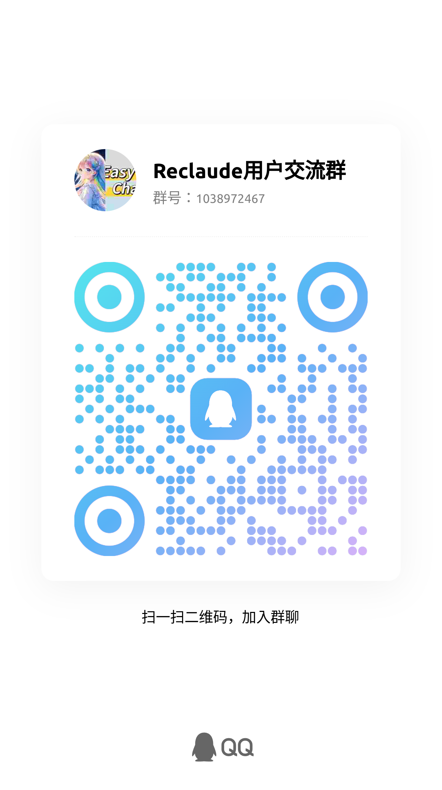

# reclaude

这是一个`Claude`官网的镜像服务，可部署到自己的服务器使用自定义域名访问。

## 使用方式

使用`Docker`镜像或二进制可执行文件进行部署。

### Docker
```shell
docker run -d \
  -e TZ="America/Los_Angeles" \
  -e ALL_PROXY=http://proxy.server:port \
  -e RECLAUDE_SECRET=your_secret
  adryfish/reclaude
```

### Docker Compose
创建 `docker-compose.yml` 文件，内容如下：
```yaml
services:
  reclaude:
    image: adryfish/reclaude
    environment:
      TZ: America/Los_Angeles
      ALL_PROXY: http://proxy.server:port
      RECLAUDE_SECRET: your_secret
    restart: unless-stopped
```
然后运行以下命令启动容器：
```shell
docker-compose up -d
```

### 二进制文件
1. 下载适用于您平台的二进制文件。
<!-- - [Windows](https://example.com/windows-reclaude) -->
- [Linux 下载](https://github.com/adryfish/reclaude/releases/download/1.11.1/reclaude_linux)
<!-- - [macOS](https://example.com/macos-reclaude) -->
2. 运行命令：
   ```shell
   ./reclaude
   ```

## 📢 广告

<div style="border: 2px solid #f39c12; padding: 15px; background-color: #fffbe6; border-radius: 10px;"> 
  <details open> 
    <summary><b>🌟 推荐工具：EasyChat - Claude 官网镜像服务</b></summary>

🛠️ EasyChat 是一个基于 Reclaude 部署的在线服务，适合不方便自建但希望使用 Claude 的用户。

- 🚀 **免注册体验**：开箱即用，完整还原官网功能，点击即可开始使用。
- 🌐 **国内可访问**：无需科学上网，直连 Claude 官网服务。
- 🤝 **共享会员机制**：支持使用 Claude 会员账号，无需担心封号风险。

🔗 **访问地址**：<a href="https://easychat.top" target="_blank">https://easychat.top</a>

  </details>
</div>


## 环境变量

| 变量名 | 说明 | 默认值 |
|-------------|--------------------|--------|
| TZ | 时区 | UTC |
| ALL_PROXY | 代理服务器地址 | 选填 |
| SERVER_PORT | 服务器启动的端口 | 4000 |
| CONTENT_SERVER_PORT | content服务启动的端口 | 4010 |
| MAIN_SERVER_URL | 主服务器地址，使用自定义域名必须设置，如https://demo.reclaude.com | http://localhost:4000 |
| CONTENT_SERVER_URL | content服务器地址，使用自定义域名建议设置，例如https://content.reclaude.com | http://localhost:4010 |
| RECLAUDE_SECRET | 一个加密的SECRET，没有设置则随机生成一个，但每次重启session会失效 | 无 |
| RECLAUDE_SHOW_SESSION_KEY | 是否返回sessionKey | true |
| RECLAUDE_DISABLE_ADMIN_FEATURE | 设置则不能打开setting中的账单等敏感页面，对应的接口也会屏蔽 | false |

CONTENT服务相关变量可以不配置，不配置预览功能无法使用，对主要功能没有影响。本地默认无法预览

## API接口
兼容`Fuclaude`

### OAuth Token
```shell
curl -X POST 'http://localhost:4000/manage-api/auth/oauth_token' \
-H 'Content-Type: application/json' \
-d '{
    "session_key": "sk-ant-sid01-xxx",
    "unique_name": "test",
    "expires_in": 600
}'
```

### 直接登录

可以使用以下URL直接登录：
```text
/login_token?session_key=sk-xxx
```

### 带指纹的 OAuth 接口
```shell
curl -X POST 'http://localhost:4000/reclaude/auth/oauth_token' \
-H 'Content-Type: application/json' \
-d '{
    "session_key": "sk-ant-sid01-xxx",
    "unique_name": "test",
    "expires_in": 600,
    "proxy_server": "代理服务器(可选)",
    "fingerprint_emulation": "目前是chrome_133,暂时不支持修改(可选)"
    "fingerprint_os": "操作系统，如windows, macos, linux(可选)"
}'
```


## 用户交流

扫码加入QQ群与其他用户交流：

